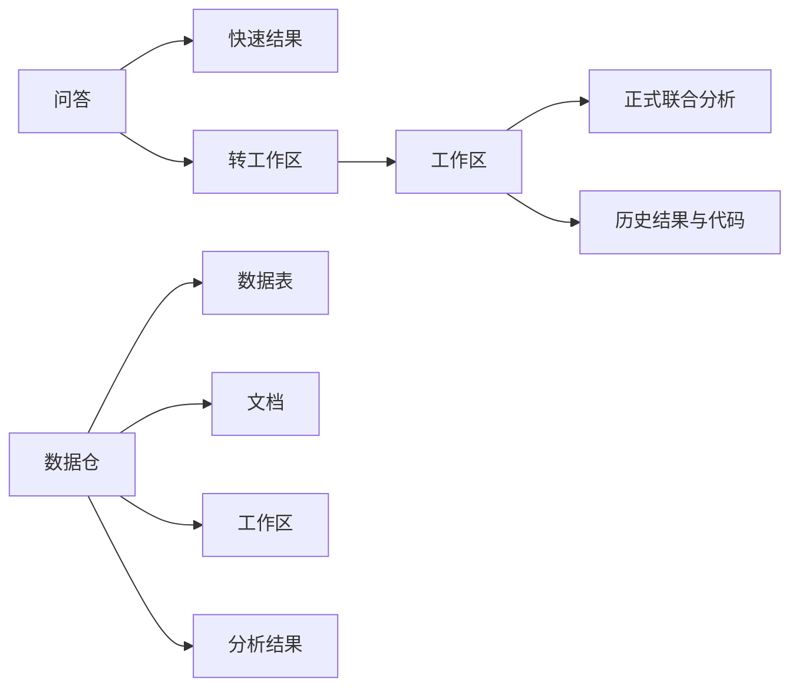

# 前端改版草图

## 1. 目标

这份文档用于收敛 `frontend-next` 的产品结构和页面职责，减少当前前端中过多的解释性文字，并让三个主模块形成清晰分工。

当前改版目标不是先追求视觉包装，而是先统一：

1. 导航结构
2. 页面职责
3. 信息密度
4. 弹窗边界
5. 文案精简原则

---

## 2. 顶层结构

左侧导航保留三个一级模块：

- 问答
- 工作区
- 数据仓

它们分别代表三种使用模式：

### 问答

轻量分析入口，用于快速发问、快速上传、快速出结果，并支持一键转为工作区。

### 工作区

正式分析主阵地，用于多文件联合分析、上下文维护、结果沉淀和持续分析。

### 数据仓

统一资产管理台，用于展示和管理所有数据表、文档、工作区与分析结果。

---

## 3. 三个模块的产品定义

### 3.1 问答

问答负责：

- 快速提问
- 临时上传数据或文档
- 返回分析结果
- 一键转工作区

问答不负责：

- 复杂资产管理
- 多表关系维护
- 工作区属性长期维护

一句话定义：

**问答是快速分析入口，不是正式分析后台。**

### 3.2 工作区

工作区负责：

- 多文件联合分析
- 多表关系维护
- 文档上下文参与分析
- 本次结果查看
- 历史结果回看
- 执行代码查看

工作区不负责：

- 全局资产总表管理
- 复杂对象清单浏览

一句话定义：

**工作区是正式联合分析主战场。**

### 3.3 数据仓

数据仓负责：

- 展示全部数据表
- 展示全部文档
- 展示全部工作区
- 展示全部分析结果
- 与后端资产对象保持直观对齐

数据仓不负责：

- 主要分析行为
- 多步分析交互

一句话定义：

**数据仓是全量资产总表，不是分析主界面。**

---

## 4. 页面文案精简原则

后续改版时，优先删除以下文字：

- 页面顶部的大段说明文案
- 重复解释按钮用途的句子
- 卡片内部的“如何使用本功能”型文字
- 已经能由结构本身表达的说明

应保留的文字：

- 页面标题
- 模块名
- 按钮名
- 状态
- 字段标签
- 空状态
- 错误提示
- 危险操作确认

原则是：

**尽量靠布局表达，不靠解释表达。**

---

## 5. 问答页草图

### 5.1 页面定位

问答页是轻量入口，重点是：

- 快速问
- 快速看结果
- 快速决定是否转为工作区

### 5.2 页面结构

```text
┌────────────────────────────────────────────────────────────────────┐
│ 问答                                                [上传] [转工作区] │
├────────────────────────────────────────────────────────────────────┤
│                                                                    │
│ 对话区                                                             │
│                                                                    │
│ 用户：......                                                       │
│ AI：摘要 / 结果预览 / 代码折叠                                     │
│                                                                    │
│ 用户：......                                                       │
│ AI：......                                                         │
│                                                                    │
├────────────────────────────────────────────────────────────────────┤
│ [ 输入分析问题.............................................. ] [发送] │
└────────────────────────────────────────────────────────────────────┘
```

### 5.3 问答页保留内容

- 对话流
- 上传按钮
- 转工作区按钮
- 结果摘要
- 表格或图表预览
- SQL / Python 折叠区

### 5.4 问答页移除内容

- 复杂工作区属性管理
- 冗长欢迎语
- 过重的上下文说明
- 大块资产列表

### 5.5 问答页设计原则

- 保持轻量
- 不承担复杂管理职责
- 能自然升级到工作区

---

## 6. 工作区页草图

### 6.1 页面定位

工作区页是主要分析阵地，进入页面后应立即可开始正式分析。

### 6.2 页面结构

```text
┌─────────────────────────────────────────────────────────────────────┐
│ 工作区 / 名称                                   [信息] [资产] [关系] [设置] │
├─────────────────────────────────────────────────────────────────────┤
│                                                                     │
│ 分析输入区                                                          │
│ ┌───────────────────────────────────────────────────────────────┐   │
│ │ 输入分析问题...                                                │   │
│ └───────────────────────────────────────────────────────────────┘   │
│                                                     [执行分析]     │
│                                                                     │
├─────────────────────────────────────────────────────────────────────┤
│ 本次分析结果                                                        │
│ ┌───────────────────────────────┬────────────────────────────────┐  │
│ │ 结果表 / 图表                  │ 摘要                           │  │
│ └───────────────────────────────┴────────────────────────────────┘  │
│                                                                     │
│ 执行代码（折叠）                                                    │
│ ┌───────────────────────────────────────────────────────────────┐   │
│ │ SQL / Python                                                  │   │
│ └───────────────────────────────────────────────────────────────┘   │
│                                                                     │
├─────────────────────────────────────────────────────────────────────┤
│ 历史结果                                                            │
│ [结果卡片] [结果卡片] [结果卡片]                                   │
└─────────────────────────────────────────────────────────────────────┘
```

### 6.3 工作区页首页只保留

- 工作区名称
- 分析输入框
- 本次分析结果
- 执行代码
- 历史结果

### 6.4 工作区页不直接展开

- 工作区描述
- 数据表清单
- 文档清单
- 关系管理
- 设置项

这些统一收进按钮和弹窗。

### 6.5 工作区弹窗结构

#### 信息弹窗

- 工作区名称
- 工作区描述
- 创建时间
- 更新时间
- 数据表数量
- 文档数量
- 关系数量
- 最近分析数

#### 资产弹窗

使用 tabs：

- 数据表
- 文档
- 分析结果

#### 关系弹窗

- 关系列表
- 新建关系
- 编辑关系
- 删除关系
- 自动识别

#### 设置弹窗

- 修改工作区名称
- 修改描述
- 删除工作区

### 6.6 工作区页设计原则

- 页面主体是分析台
- 资产管理后退到弹窗
- 强化“输入 -> 结果 -> 回看”的主流程

---

## 7. 数据仓页草图

### 7.1 页面定位

数据仓页是全局资产管理台，用于查看和管理全部数据对象。

### 7.2 页面结构

```text
┌────────────────────────────────────────────────────────────────────┐
│ 数据仓                                               [上传] [新建] │
├────────────────────────────────────────────────────────────────────┤
│ [搜索资产......................................................]   │
├────────────────────────────────────────────────────────────────────┤
│ [数据表] [文档] [工作区] [分析结果]                               │
├────────────────────────────────────────────────────────────────────┤
│                                                                    │
│ 当前 tab 的表格区域                                                │
│                                                                    │
└────────────────────────────────────────────────────────────────────┘
```

### 7.3 四个 tab

#### 数据表

建议字段：

- 名称
- 表名
- 所属工作区
- 行数
- 列数
- 更新时间
- 操作

#### 文档

建议字段：

- 名称
- 类型
- 所属工作区
- 状态
- chunk 数
- 更新时间
- 操作

#### 工作区

建议字段：

- 名称
- 描述摘要
- 数据表数
- 文档数
- 关系数
- 更新时间
- 操作

#### 分析结果

建议字段：

- 问题
- 所属工作区 / 来源
- 类型（SQL / Python）
- 时间
- 操作

### 7.4 数据仓页设计原则

- 列表驱动
- 资产总表导向
- 少说明，多状态与结构
- 不承担主要分析交互

---

## 8. 三个模块的关系



---

## 9. 具体改版原则

后续实际改页面时，按以下顺序推进：

1. 先改工作区
2. 再改数据仓
3. 最后收问答

原因：

- 工作区是核心主战场
- 数据仓是全局资产层
- 问答是轻量入口，最后收最稳

---

## 10. 当前结论

当前前端应围绕以下原则重构：

- 问答负责快速分析
- 工作区负责正式联合分析
- 数据仓负责统一管理全部资产与结果

这三个模块一旦边界清楚，前端中大量不必要说明文字就可以自然删除，因为结构本身已经足够表达产品意图。
